# Analysis Overview:

This analysis was performed in order to provide a client with data that they can use to better determine whether their store in Oahu will be sustainable year- round. Using the months of June and December, two extremes, the analysis provided the client with summary statistics for them to base their decision on. This analysis utilized Python, Pandas functions and methods, as well as SQLAlchemy. 

## Results:
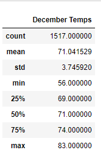 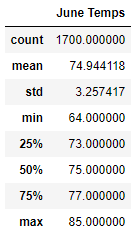
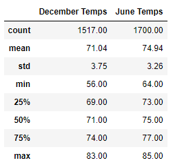

- The first big difference I notice is that between December temperatures and June temperatures, there is a large gap in terms of the size of the data. Despite this, it seems that there is a larger spread in the December temp range based on its dataset having a larger standard deviation of 3.75, while June had a standard deviation of 3.26, even with the larger count of data. The standard deviation will reflect clustering of datapoints that are relative to the mean. This means that December temperatures, are going to have more deviation around the mean temperature, compared to June.

- The good news for our client is that the maximum temperature difference between December and June (83.00 and 85.00, respectively) is essentially negligable for eager vacationgoers. The even better news is that the upper quartile for both, representing data of which 75% of the points of the dataset are arranged in increasing order- are reflective of seemingly enjoyable, for most people (temperatures of 74.00 in December, and 77.00 degrees in December).

-In terms of attracting business, June temperatures do dip down to 64.00 degrees occasionally, while December, at it's lowest reaches a balmy 56.00 degrees. This weather is arguably still 'vacation weather' for most people who would be traveling to a warmer climate area, like Oahu, for vacation, especially in December. 

## Summary:

Based on the analysis, our client should feel comfort in the fact that while there are some differences in the two data sets, we are comparing extreme months that anywhere other than Hawaii, would reflect extreme temperature differences, and Oahu does not. In fact, Oahu, Hawaii is listed on https://www.twoscotsabroad.com/warm-places-to-visit-in-december-in-usa/ as being a number two vacation destination, especially in December. Oahu is a destination sought after for temperature consistency, regardless of the time of year, and so it is constantly a popular destination for vacation goers. This should translate into a reliable source of income for our client, provided that he caters to tourists as his clientele. 

### Additional Queries To Consider:

Additional queries to consider, would detail about the precipitation during the months of December and June. By including precipitation, we can determine whether the rains may potentially curtail our clients plans.

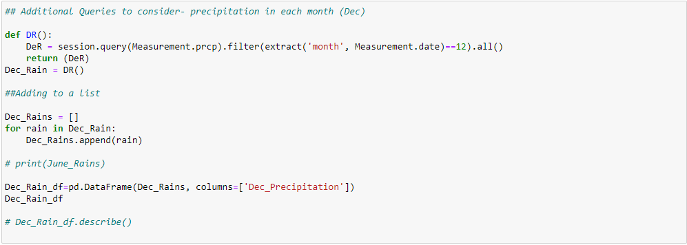
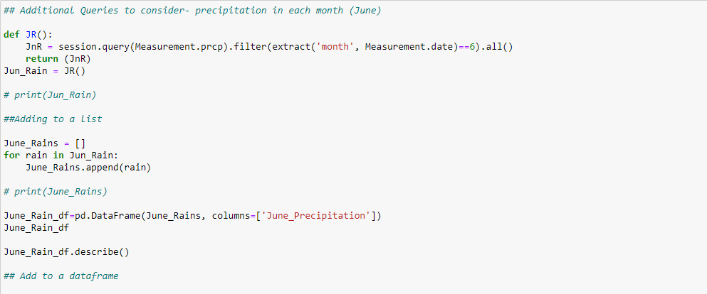

By scouring the database in a similar measure as before, we can compare the precipitation for both the months of December and June.

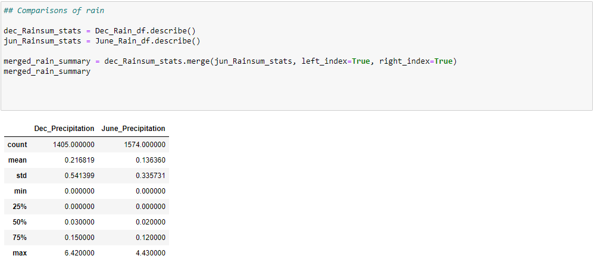

This is useful in helping us understand the average, standard deviation and range of the amount that it has rained, typically in those months. However, it isn't helpful in creating a picture of how frequently those potential increments of rain happen.

By associating the rain increments with the dates, we can create a frequency graph of how *often* those certain rainfalls happen, which will be more useful for our client, and provide more reassurance that their plan of business will pan out.

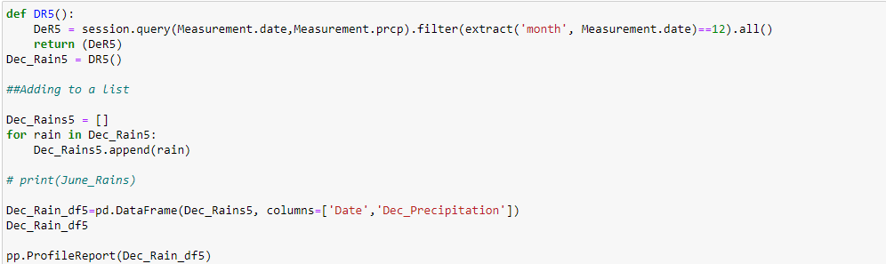
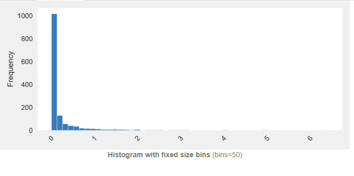

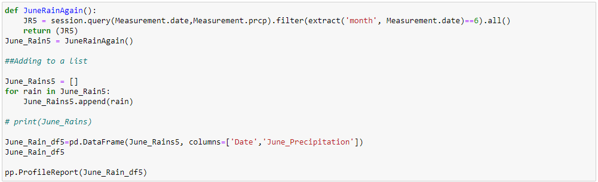
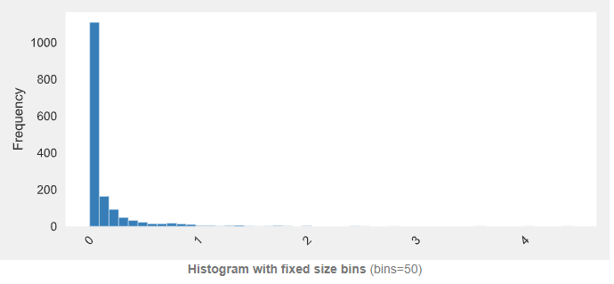

Once our client realizes that a majority of recorded rainfall is well below an inch, they should feel confident in their business decision.

Any hesitancies from our client about the temperature, could also be put to rest with a similar query, utilizing the dates as a way to aggregate frequencies.

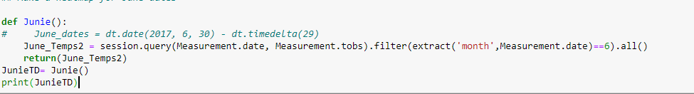
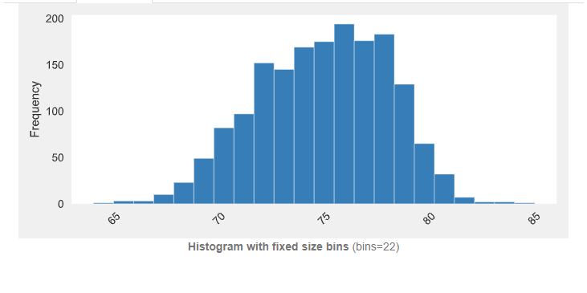

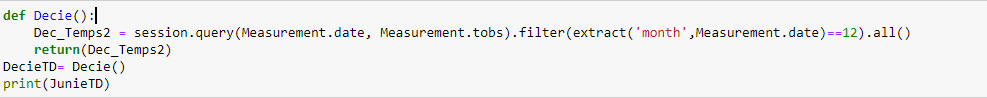
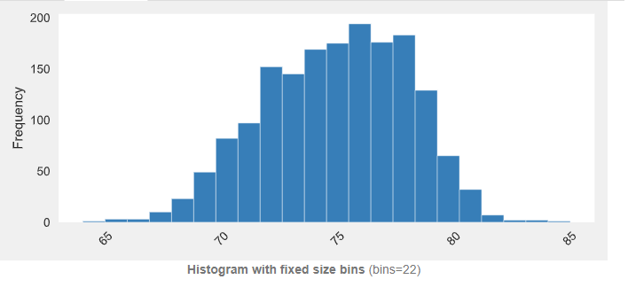

